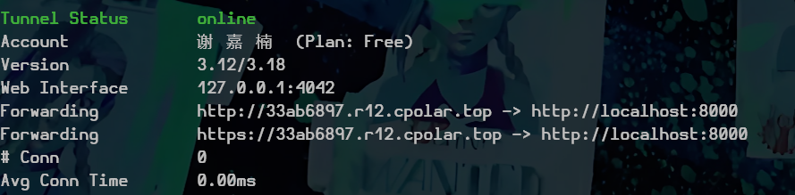
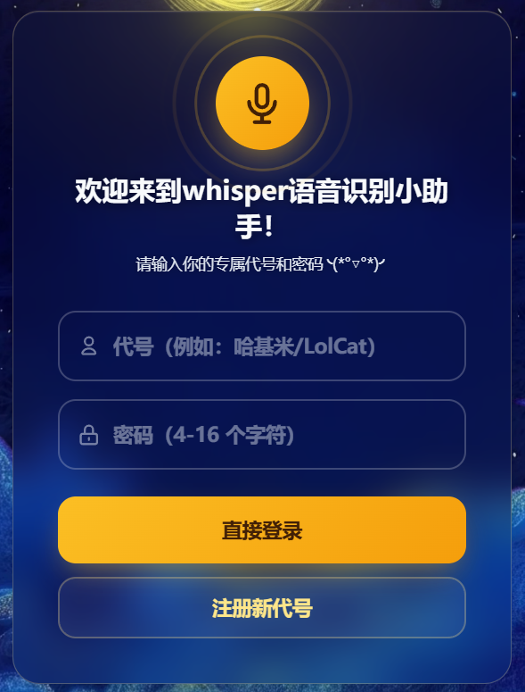
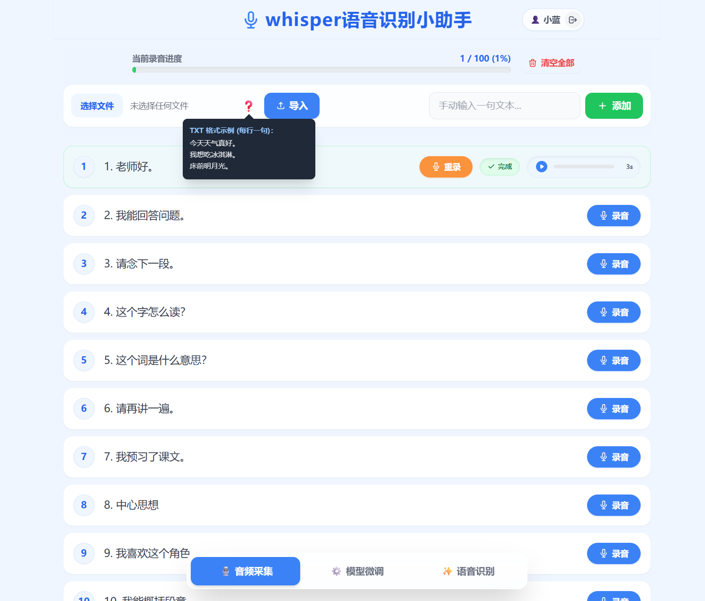
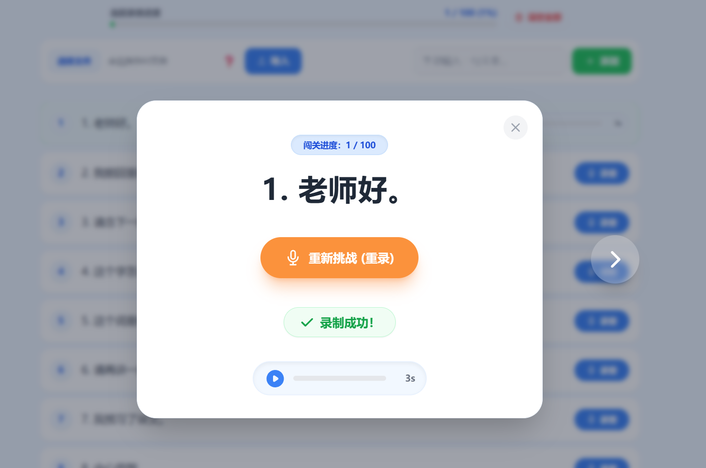
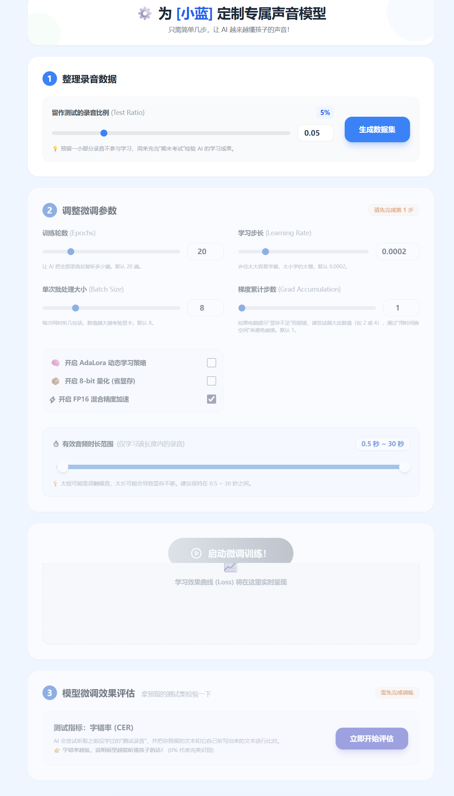
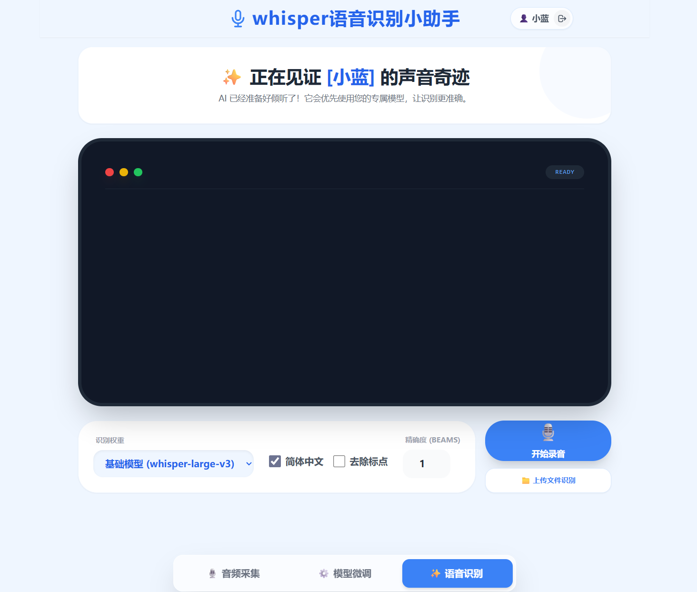

# Whisper 语音识别项目 · 网页端部署与使用

> 项目整体定位、核心特点与目录结构见根目录 [README.md](../README.md)。本文档专注于**网页端部署**与**使用教程**两件事。

## 一、部署与公网访问

部署分两步：先把后端在本机跑起来（**1.1，两条路都要做**），再选一种方式把它暴露到公网——

- **路径 A · cpolar 内网穿透（1.2）**：几条命令拿到一个临时公网地址，适合**快速验证 / 临时演示**；免费版地址每次重启会变、不固定。
- **路径 B · Cloudflare 隧道 + 固定域名（1.3）**：固定入口 `https://app.carespeechai.cn`，适合**正式公网部署**；详细步骤见 [`deploy/README.md`](../deploy/README.md)。

### 1.1 环境准备（两条路共用）

1. **GPU 硬件**：一张支持 CUDA 的 NVIDIA 显卡（用于模型微调与推理加速）。

2. **克隆项目代码**

   ```bash
   git clone https://github.com/xjn-La-La-land/whisper-finetune-plus.git
   cd whisper-finetune-plus
   ```

3. **创建环境并安装依赖**（Web 端用 `requirements.txt`，conda 环境名 `whisper`）

   ```bash
   conda create -n whisper python=3.11 -y && conda activate whisper
   sudo apt update && sudo apt install ffmpeg                 # 系统依赖：音频流转码
   pip install -r requirements.txt
   ```

   > 安卓 App 开发是另一套环境（`env.yaml`，环境名 `whisper-app`），见 [`Adroid_app.md`](Adroid_app.md)。

4. **下载基座模型**到 `./whisper-base-models`（默认走 ModelScope，境内直连免代理；不传模型名 = 下载全部）

   ```bash
   python download_whisper_models.py whisper-small      # 按需指定，这里只下 small
   ```

5. **启动后端**：在项目根目录启动 FastAPI 服务，绑本机 `8000` 端口（两种穿透方式都从本机连它）

   ```bash
   uvicorn main:app --host 127.0.0.1 --port 8000
   ```

   > 想直接在局域网内访问可改成 `--host 0.0.0.0`；开发调试可加 `--reload`。

### 1.2 路径 A：cpolar 内网穿透（快速验证）

用 cpolar 把本机 `8000` 端口映射到一个临时公网地址。

在 [cpolar 官网](https://dashboard.cpolar.com/get-started) 注册账号并安装：

```bash
curl -L https://www.cpolar.com/static/downloads/install-release-cpolar.sh | sudo bash
```

配置认证（token 在官网查看）：

```bash
cpolar authtoken YOUR_TOKEN
```

启动 HTTP 穿透（另开一个终端）：

```bash
cpolar http 8000
```

等待生成公网链接，在浏览器打开即可进入 Web 交互界面。



> ⚠️ 免费版 cpolar 的公网地址每次重启都会变化、且不带固定域名，仅适合临时验证；要长期稳定的固定入口请用路径 B。

### 1.3 路径 B：Cloudflare 隧道 + 固定域名（正式公网部署）

正式上线用 Cloudflare 具名隧道，把固定域名 **`https://app.carespeechai.cn`** 打到本机 `127.0.0.1:8000`，无需公网 IP、自带 HTTPS。整体链路：

```
浏览器 → https://app.carespeechai.cn → Cloudflare 具名隧道 carespeech → 本机 127.0.0.1:8000
```

完整步骤（设置 `JWT_SECRET_KEY`、安装 cloudflared、隧道凭据与配置、开机 / 重启实例后的恢复流程等）见 **[`deploy/README.md`](../deploy/README.md)**。这里只点出与路径 A 的关键差异：

- 后端绑 `127.0.0.1:8000`（只给本机隧道连，不直接对外）；
- **必须显式设置固定的 `JWT_SECRET_KEY`**，否则后端重启后所有人的登录态会集体失效；
- 入口是固定域名，不会像 cpolar 那样每次重启变化。

## 二、网页端操作实例

### 登录&注册

首先是登录界面，可以输入用户名注册账号，或登录已有账号。用户名是每个用户唯一的标识哦！



### 语音采集

登录后，我们进入音频采集界面。




音频采集首先需要上传需要录音的文本。上传的文本是一个txt文件，**其格式是每行一句录音内容**（用换行符来分割语句）。“选择文件”选择txt文件后，点击“导入”，在下方就会出现录音的每一条文本。

还可以通过“添加”按钮来手动输入录音文本。

同时，对于已经导入的文本，可以修改、删除。鼠标悬浮在对应文本的框上就会出现“修改”/“删除”按钮。

点击录音，就可以对照文本开始录音。录音的音频会自动转换为微调的格式上传到服务器上。

最后，录音界面还做了一个“沉浸模式”，点击录音任务的框即可显示悬浮模糊效果：



### 微调训练

录音完成之后，我们有了用户个人定制的训练数据，下面就可以进入模型微调环节了。



这里可以控制模型微调过程中的一些参数。点击“启动微调训练”即可一键开始微调。微调过程中的Loss曲线会在监控面板实时绘制。并且微调完成后，可以在测试集上评估微调效果，计算字错率。

### 语音识别

有了微调好的模型，就可以使用它来进行语音识别的应用了！



在网页端可以直接录制音频，进行实时语音识别；也可以上传音频文件（.wav格式），对其进行识别。识别的文字会显示在上面这个“终端”文本框中。

可以选择使用的模型，如果没有微调的模型，默认使用Base模型。
